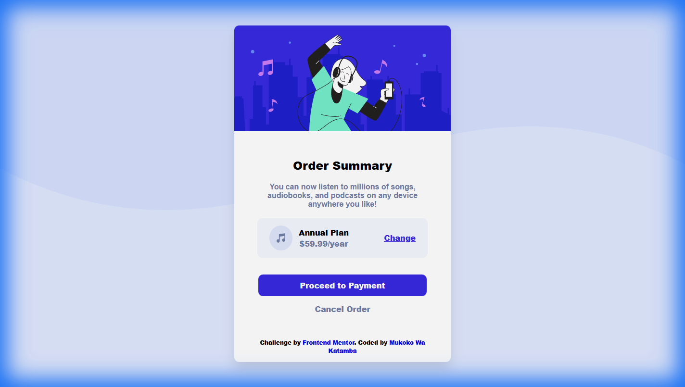
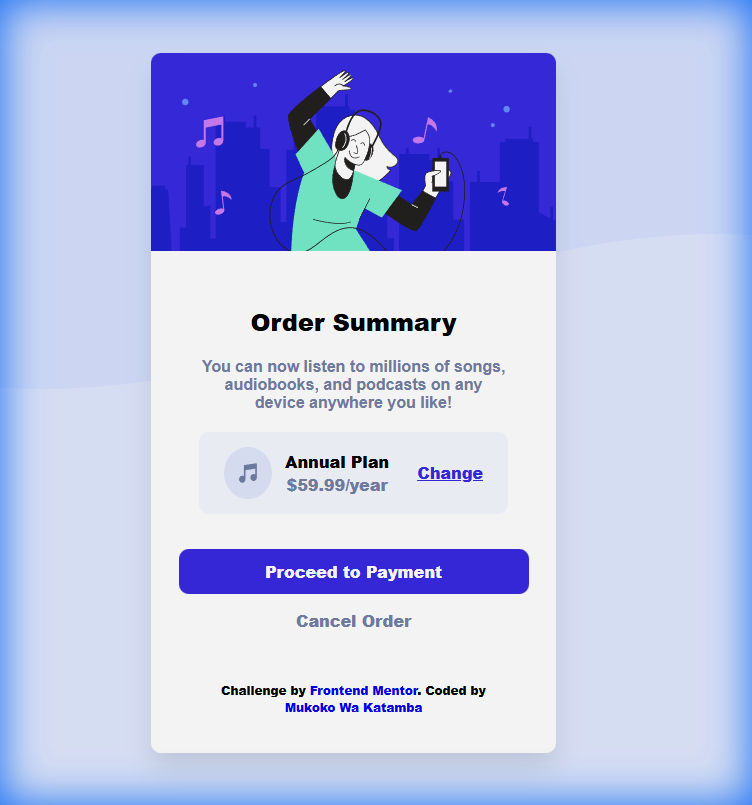
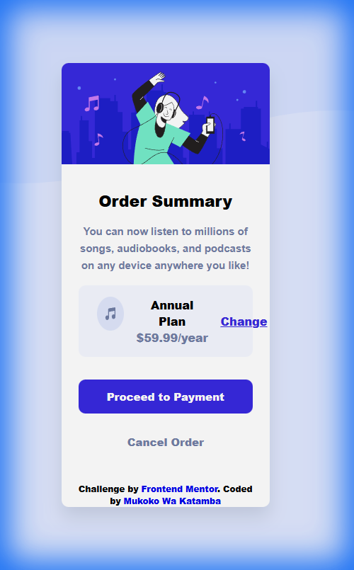
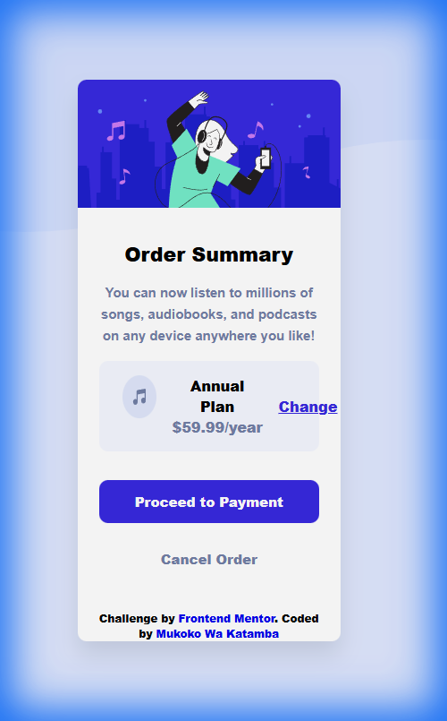

# 🎵 Order Summary Component


## 📋 Table des matières

- [Aperçu](#aperçu)
  - [Le défi](#le-défi)
  - [Capture d'écran](#capture-décran)
  - [Liens](#liens)
- [Mon processus](#mon-processus)
  - [Construit avec](#construit-avec)
  - [Fonctionnalités](#fonctionnalités)
  - [Ce que j'ai appris](#ce-que-jai-appris)
- [Installation](#installation)
- [Auteur](#auteur)

## 📖 Aperçu

### Le défi

Ce projet est une carte de résumé de commande élégante et responsive, créée dans le cadre d'un challenge Frontend Mentor. L'objectif était de reproduire fidèlement le design fourni tout en implémentant des interactions utilisateur fluides.

Les utilisateurs peuvent :

- ✅ Visualiser une mise en page optimale selon la taille de leur appareil
- ✅ Voir les états de survol pour tous les éléments interactifs
- ✅ Interagir avec des boutons stylisés et accessibles
- ✅ Profiter d'une expérience utilisateur fluide et moderne

### Capture d'écran

````carousel


**Desktop (1440px)** - Design complet avec arrière-plan desktop

<!-- slide -->



**Tablette (768px)** - Arrière-plan mobile activé, carte adaptée

<!-- slide -->



**Mobile (375px)** - Boutons tactiles 48px, espacements optimisés

<!-- slide -->



**Petit Mobile (320px)** - Utilisation maximale de l'espace
````

### Liens

- 🔗 Solution URL: [Voir sur Frontend Mentor](https://www.frontendmentor.io/solutions/)
- 🌐 Live Site URL: [Démo en ligne](https://your-live-site-url.com)

## 🛠️ Mon processus

### Construit avec

- **HTML5** sémantique pour une structure claire et accessible
- **CSS3** avec variables personnalisées (Custom Properties)
- **Flexbox** pour une mise en page flexible et responsive
- **Mobile-first workflow** pour une approche progressive
- **Google Fonts** - Police Red Hat Display
- **Transitions CSS** pour des animations fluides

### Fonctionnalités

#### 🎨 Design moderne et épuré
- Carte centrée avec ombres portées élégantes
- Palette de couleurs harmonieuse avec variables CSS
- Typographie soignée avec Red Hat Display
- Border-radius et espacement cohérents

#### 📱 Responsive Design
- Adaptation automatique pour mobile et desktop
- Media queries optimisées pour tous les écrans
- Images et conteneurs fluides

#### ⚡ Interactions utilisateur
- **Bouton "Change"** : Effet de survol avec changement d'opacité
- **Bouton "Proceed to Payment"** : Animation de levée au survol avec ombre
- **Bouton "Cancel Order"** : Changement de couleur au survol
- **États de focus** : Contours visibles pour l'accessibilité

#### ♿ Accessibilité
- Balises sémantiques HTML5
- Attributs `alt` descriptifs pour les images
- États de focus visibles pour la navigation au clavier
- Contraste de couleurs conforme aux normes WCAG

### Ce que j'ai appris

Ce projet m'a permis de renforcer mes compétences en :

1. **CSS Variables** : Utilisation de variables CSS pour une gestion centralisée des couleurs
```css
:root {
    --Pale-blue: hsl(225, 100%, 94%);
    --Bright-blue: hsl(245, 75%, 52%);
    --Very-pale-blue: hsl(225, 100%, 98%);
}
```

2. **Flexbox avancé** : Combinaison de flex avec `margin-left: auto` pour l'alignement
```css
.btn-1 {
    margin-left: auto;
}
```

3. **Effets de survol sophistiqués** : Animations combinées pour une meilleure UX
```css
.btn-2:hover {
    background-color: hsl(245, 75%, 60%);
    transform: translateY(-2px);
    box-shadow: 0 10px 20px rgba(0, 0, 0, 0.2);
}
```

4. **Responsive Design** : Approche mobile-first avec media queries ciblées

## 🚀 Installation

### Prérequis
- Un navigateur web moderne
- (Optionnel) Un serveur local pour le développement

### Étapes d'installation

1. **Cloner le repository**
```bash
git clone https://github.com/votre-username/order-summary-component.git
```

2. **Naviguer dans le dossier**
```bash
cd order-summary-component
```

3. **Ouvrir le projet**
   - Ouvrez `index.html` directement dans votre navigateur, ou
   - Utilisez Live Server dans VS Code pour un rechargement automatique

### Structure du projet
```
order-summary-component/
├── images/
│   ├── favicon-32x32.png
│   ├── icon-music.svg
│   ├── illustration-hero.svg
│   └── pattern-background-desktop.svg
├── design/
│   ├── desktop-design.jpg
│   ├── desktop-preview.jpg
│   └── mobile-design.jpg
├── index.html
├── styles.css
└── README.md
```

## 👨‍💻 Auteur

- **Nom** : Mukoko Wa Katamba
- **Frontend Mentor** : [@votre-username](https://www.frontendmentor.io/profile/votre-username)
- **GitHub** : [@votre-username](https://github.com/votre-username)

---

## 🙏 Remerciements

Challenge proposé par [Frontend Mentor](https://www.frontendmentor.io?ref=challenge). Merci à la communauté pour le support et les retours constructifs !

---

<div align="center">
  <strong>⭐ N'hésitez pas à laisser une étoile si ce projet vous a plu ! ⭐</strong>
</div>
